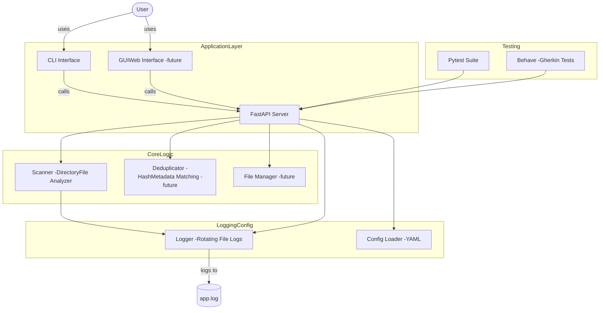

title: SmartMedia Deduplicator – Architecture Overview
version: 0.2.0
last_updated: 2025-03-29
generated_by: Schematicus
source_trigger: Bitwise milestone snapshot
---

```mermaid

graph TD
    User([User])

    subgraph "ApplicationLayer"
        CLI[CLI Interface]
        API[FastAPI Server]
        UI[GUIWeb Interface -future]
    end

    subgraph "CoreLogic"
        Scanner[Scanner -DirectoryFile Analyzer]
        Deduper[Deduplicator -HashMetadata Matching -future]
        FileManager[File Manager -future]
    end

    subgraph "LoggingConfig"
        Logger[Logger -Rotating File Logs]
        ConfigLoader[Config Loader -YAML]
    end

    subgraph "Testing"
        Pytest[Pytest Suite]
        Behave[Behave -Gherkin Tests]
    end

    User -->|uses| CLI
    User -->|uses| UI
    CLI -->|calls| API
    UI -->|calls| API
    API --> Scanner
    API --> Deduper
    API --> FileManager

    Scanner --> Logger
    API --> Logger
    API --> ConfigLoader

    Logger -->|logs to| logs[(app.log)]
    Pytest --> API
    Behave --> API
```