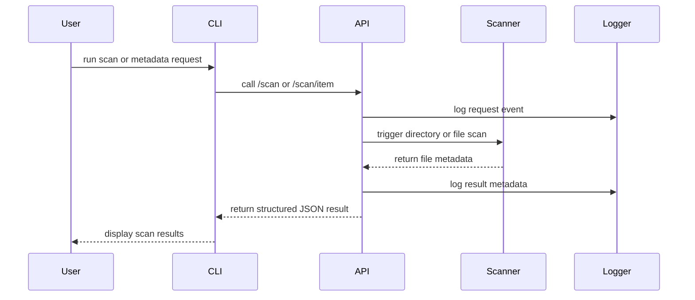

```mermaid
sequenceDiagram
    participant User
    participant CLI
    participant API
    participant Scanner
    participant Logger

    User->>CLI: run scan or metadata request
    CLI->>API: call /scan or /scan/item
    API->>Logger: log request event
    API->>Scanner: trigger directory or file scan
    Scanner-->>API: return file metadata
    API->>Logger: log result metadata
    API-->>CLI: return structured JSON result
    CLI-->>User: display scan results
```
