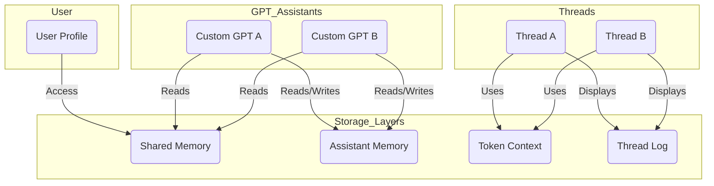

# 🧠 Memory Types in OpenAI’s LLM Ecosystem (ChatGPT & Custom GPTs)

This document outlines the different types of memory involved in the use of OpenAI's language models across chat interfaces, custom assistants, user profiles, and system layers.

---

## 📚 1. Token Context (Temporary / Thread-Level)

- **Scope:** Limited to the current conversation thread.
- **Persistence:** Exists only during the session and within the system's token window.
- **Source:** All messages (user + assistant) in the current thread, up to a token limit (~100,000 tokens in GPT-4 Turbo).
- **Storage:** Not memory in the long-term sense; this is the active working context.
- **Volatility:** Older messages are dropped once the token limit is reached.

**Use Cases:**
- Mid-thread reference tracking
- Ongoing tone and style consistency
- Temporary session memory

---

## 🧠 2. Assistant-Specific Memory (Heuristic Memory)

- **Scope:** Specific to one **custom GPT assistant**.
- **Persistence:** Long-term and persistent across sessions.
- **Source:** Facts inferred or confirmed by the user and stored inside the assistant.
- **Visibility:** Editable by the user via the ChatGPT memory settings.
- **Shared Across Threads:** Yes, but only within the assistant.

**Use Cases:**
- Persistent knowledge of user preferences (e.g., tone, timezone)
- Assistant personality shaping
- Cross-session continuity for domain-specific assistants

---

## 👤 3. User Profile Memory (Shared Memory)

- **Scope:** Attached to the user across all GPT interactions.
- **Persistence:** Long-term and shared across assistants.
- **Source:** System-learned facts and user-confirmed information.
- **Access Control:** User can view, edit, and delete entries.
- **Shared Across Assistants:** Yes (if enabled).

**Use Cases:**
- Personalization across GPTs
- User traits like name, preferences, schedule
- Seamless onboarding for new assistants

---

## 💬 4. Conversation Thread Data (Interface-Level)

- **Scope:** Each chat thread in the app (web, Mac, mobile).
- **Persistence:** Stored and visible in UI.
- **Source:** Full message history of a session.
- **Volatility:** LLM only sees as much as fits in the current token window.
- **Memory:** Not true memory — it's a transcript.

**Use Cases:**
- Reviewing past conversations
- Manual context rehydration
- Thread-specific notes or logs

---

## 💻 5. Local Storage and Cache (Device-Level)

- **Scope:** Device, browser, or app session.
- **Persistence:** Temporary; managed by app or OS.
- **Not part of AI memory.**

**Use Cases:**
- UI state persistence
- Chat history syncing across devices
- Local caching of messages

---

## 🧬 6. Training Memory (Pre-Deployment)

- **Scope:** Model knowledge learned during pretraining.
- **Persistence:** Fixed and static.
- **Source:** Public datasets up to training cutoff (e.g., April 2023 or Dec 2023).
- **Not personalized.**

**Use Cases:**
- Factual knowledge
- Reasoning capabilities
- General world understanding

---

## 🔍 Summary Matrix

| Memory Type              | Scope                     | Persistent | Shared Across Threads | User-Controllable | Notes |
|--------------------------|---------------------------|------------|------------------------|-------------------|-------|
| Token Context            | One thread                | ❌         | ❌                     | ⚠️ Indirect       | Truncated over time |
| Assistant-Specific Memory| One custom assistant      | ✅         | ✅ (within that assistant) | ✅            | Editable via assistant memory |
| Shared Memory            | User-wide                 | ✅         | ✅                     | ✅                | Personal facts shared across GPTs |
| Thread Transcript        | UI-visible thread history | ✅ (UI)    | ❌                     | ❌                | Visible but not used by the model |
| Local Cache              | Device/browser level      | ❌         | ❌                     | ⚠️                | Not AI-readable |
| Training Memory          | Model pretraining         | ✅ (fixed) | ✅                     | ❌                | Not personalized |

---

## 🗺️ Mermaid Diagram: Memory Scope and Flow

