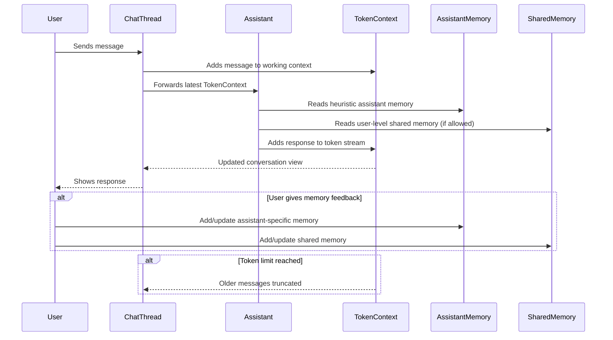

```mermaid
sequenceDiagram
    participant User
    participant ChatThread
    participant Assistant
    participant TokenContext
    participant AssistantMemory
    participant SharedMemory

    User->>ChatThread: Sends message
    ChatThread->>TokenContext: Adds message to working context

    ChatThread->>Assistant: Forwards latest TokenContext
    Assistant->>AssistantMemory: Reads heuristic assistant memory
    Assistant->>SharedMemory: Reads user-level shared memory (if allowed)

    Assistant->>TokenContext: Adds response to token stream
    TokenContext-->>ChatThread: Updated conversation view
    ChatThread-->>User: Shows response

    alt User gives memory feedback
        User->>AssistantMemory: Add/update assistant-specific memory
        User->>SharedMemory: Add/update shared memory
    end

    alt Token limit reached
        TokenContext-->>ChatThread: Older messages truncated
    end
```